# Elektronische Last

Hierbei handelt es sich um einen elektronische Last, die im Bereich von etwa 5-30 V 0-5 A mit einer maximalen durchschnittlichen Leistung von 100 W arbeitet. Zum einfacheren Debugging wurde die Funktion auf verschiedene Leiterplatten aufgeteilt. Es gibt eine Hauptplatine, die die Leistung der Quelle abnimmt und 3 Platinen (eine Platine mit Sollbruchstellen) für einen Signalgenerator (die Last kann auch gepulste Lasten aufnehmen), Hilfsspannungen und einen ersten Protoyp der Leistungsstufe inklusive Stromregelschleife.

Es können extern auch dynamische Belastungskurven vorgegeben werden. Ein Lüfter wird ab einer Grenztemperatur zugeschaltet und ab etwa 90-95°C wird die Last mit entsprechender Temperaturhysterse getrennt

Die Schaltung ist komplett "analog", besitzt also keinen Mikrocontroller.

## Schaltplan

### Hauptplatine

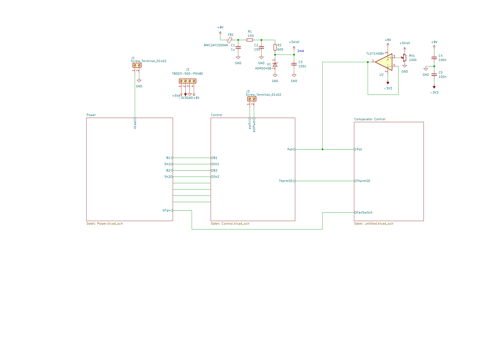
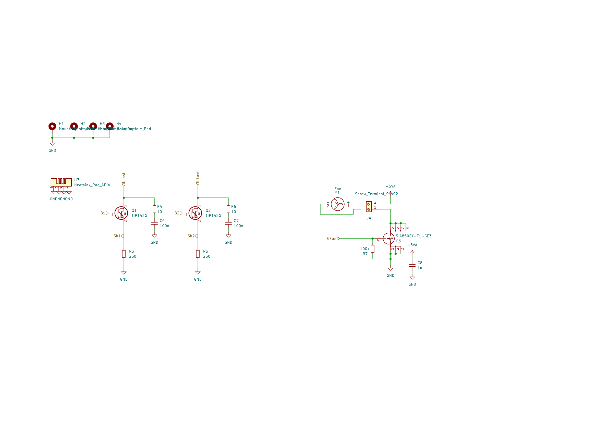
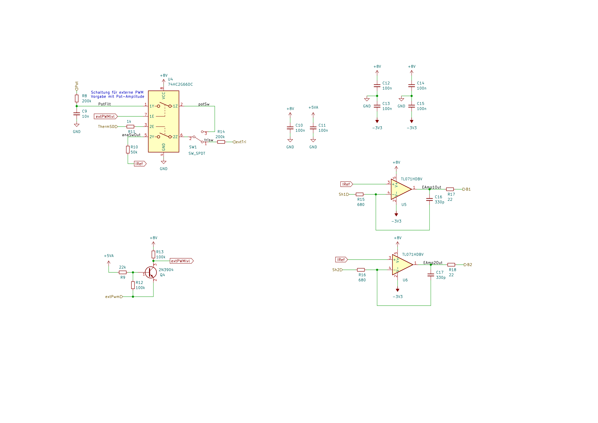
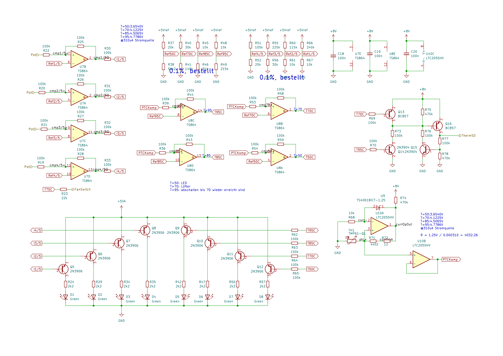

### Signalgenerator + Hilfsspannungen + Prototyp der Leistungsstufe

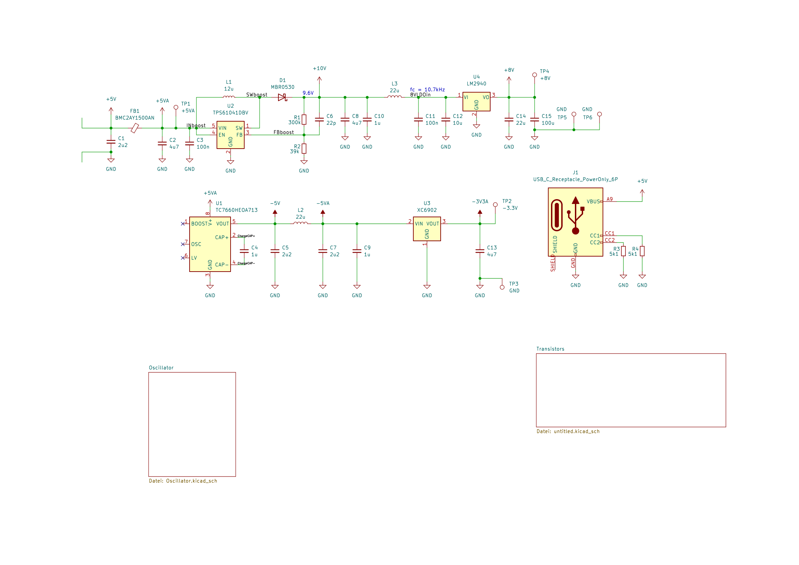
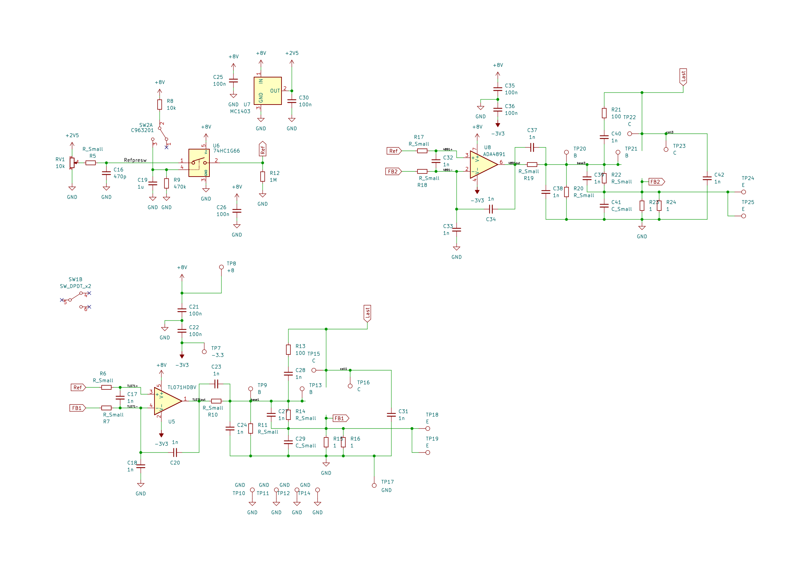
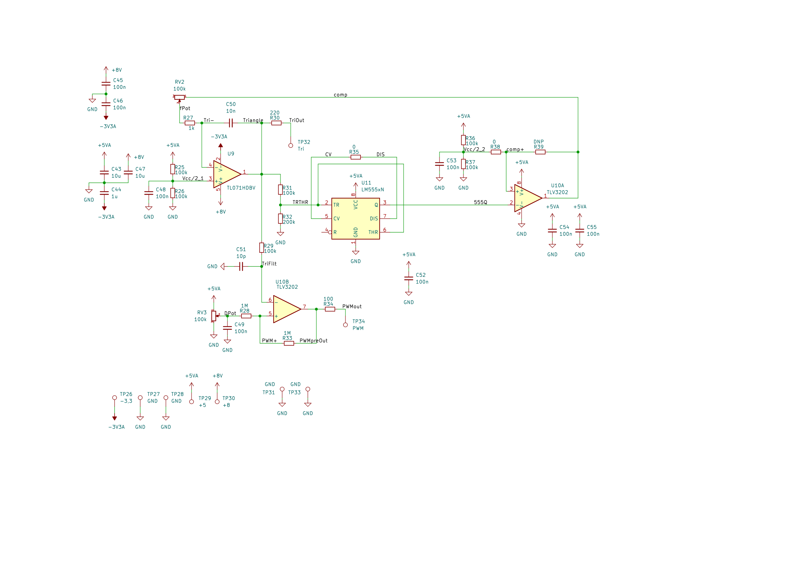

## Layout

### Hauptplatine

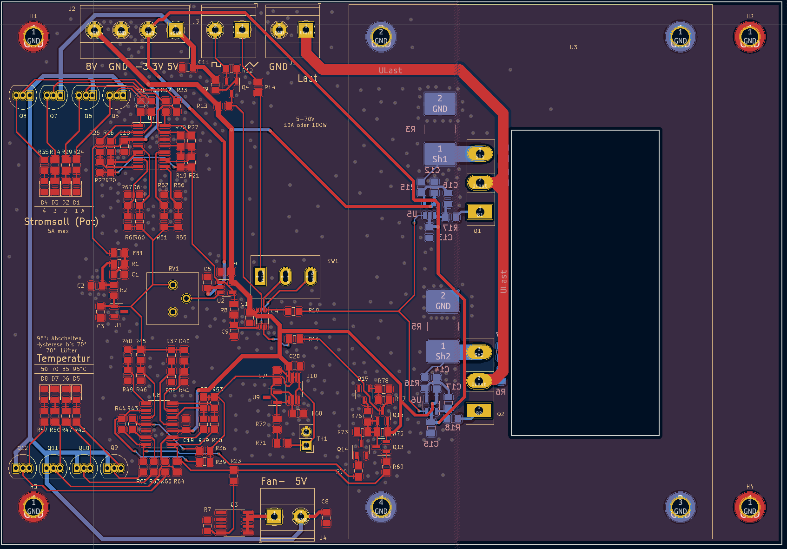

### Signalgenerator + Hilfsspannungen + Prototyp der Leistungsstufe

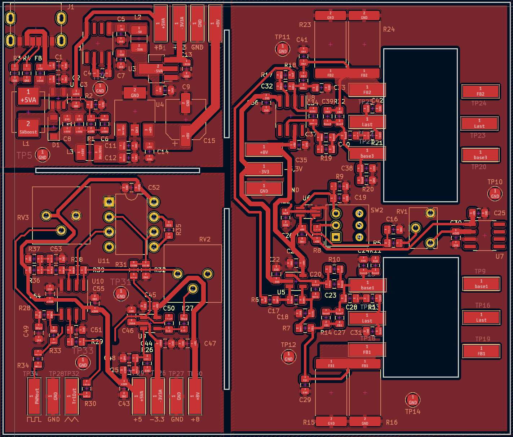

## 3D

### Hauptplatine

Hier fehlt der Kühlkörper, der über den BJTs innerhalb der weißen Markierungen sitzt.
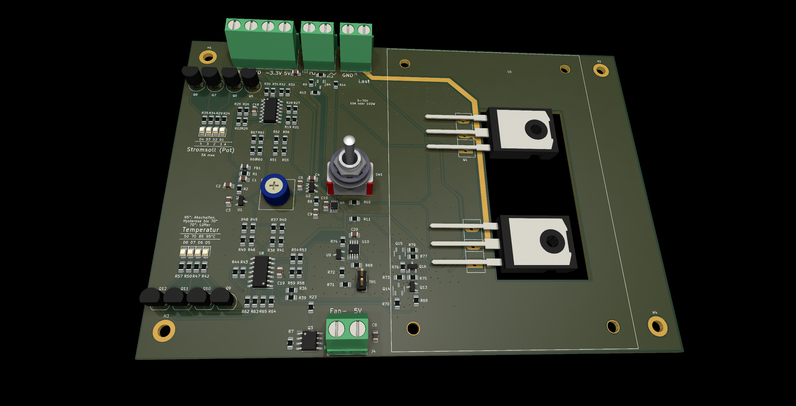

### Signalgenerator + Hilfsspannungen + Prototyp der Leistungsstufe

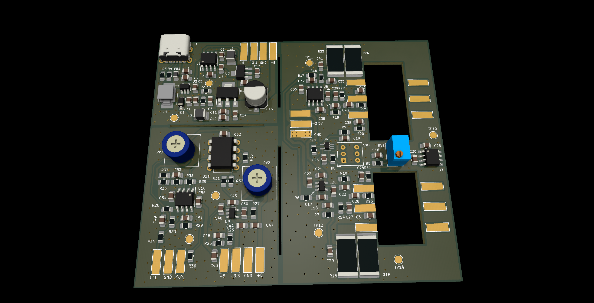
