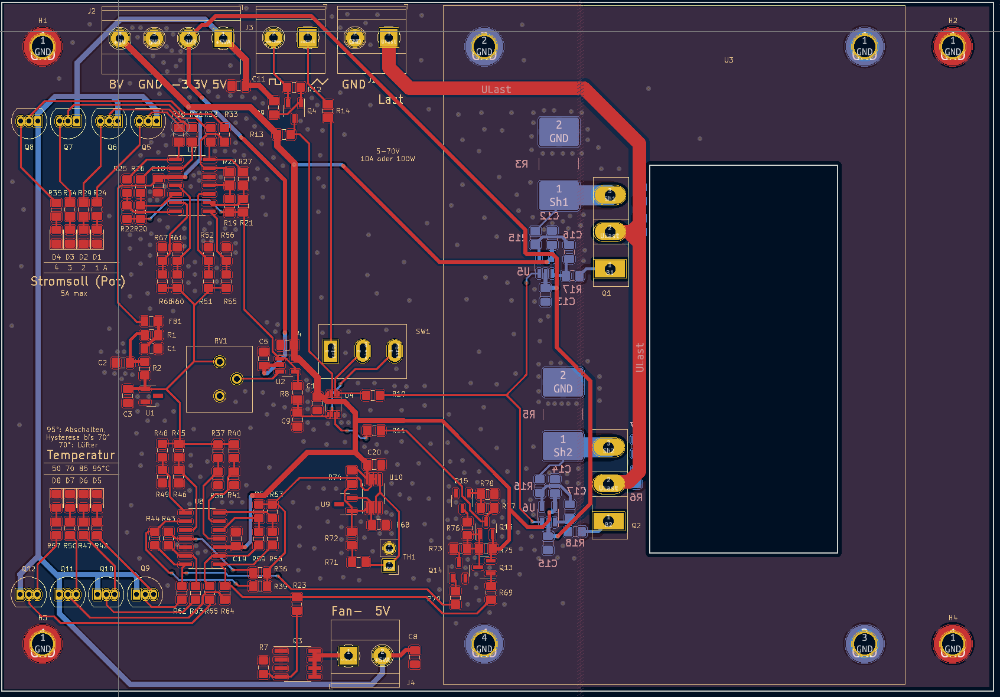
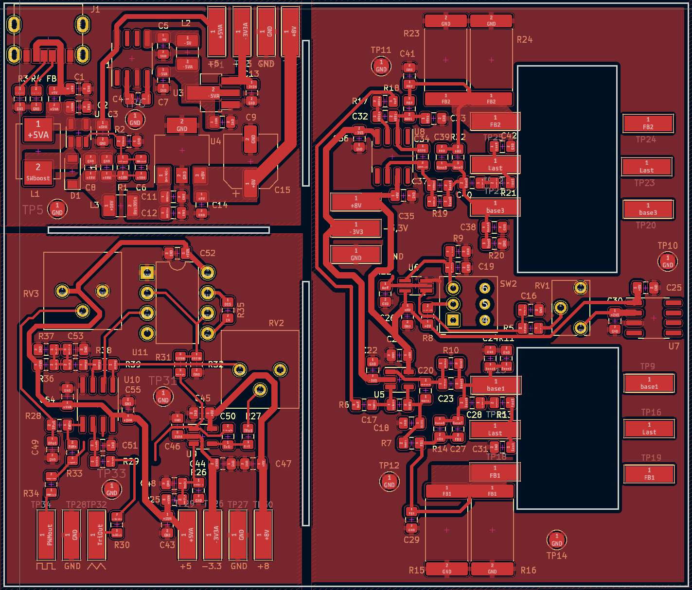
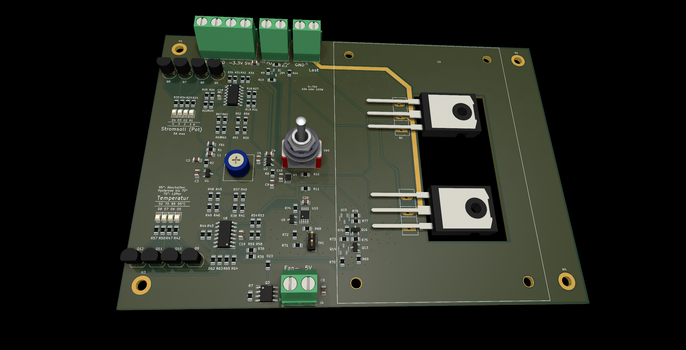

# Elektronische Last
Hierbei handelt es sich um einen elektronische Last, die im Bereich von x..y V a..b A mit einer maximalen durchschnittlichen Leistung von z W arbeitet.

## Schaltplan
Die Schaltung ist komplett "analog", besitzt also keinen Mikrocontroller.

### Leistungsplatine
#### Seite x

### Signalgenerator + Hilfsspannungen + Prototyp der Leistungsstufe
#### Seite x

## Layout
### Leistungsplatine

### Signalgenerator + Hilfsspannungen + Prototyp der Leistungsstufe

## 3D
### Leistungsplatine
Hier fehlt der Kühlkörper, der über den BJTs innerhalb der weißen Markierungen sitzt.

### Signalgenerator + Hilfsspannungen + Prototyp der Leistungsstufe
